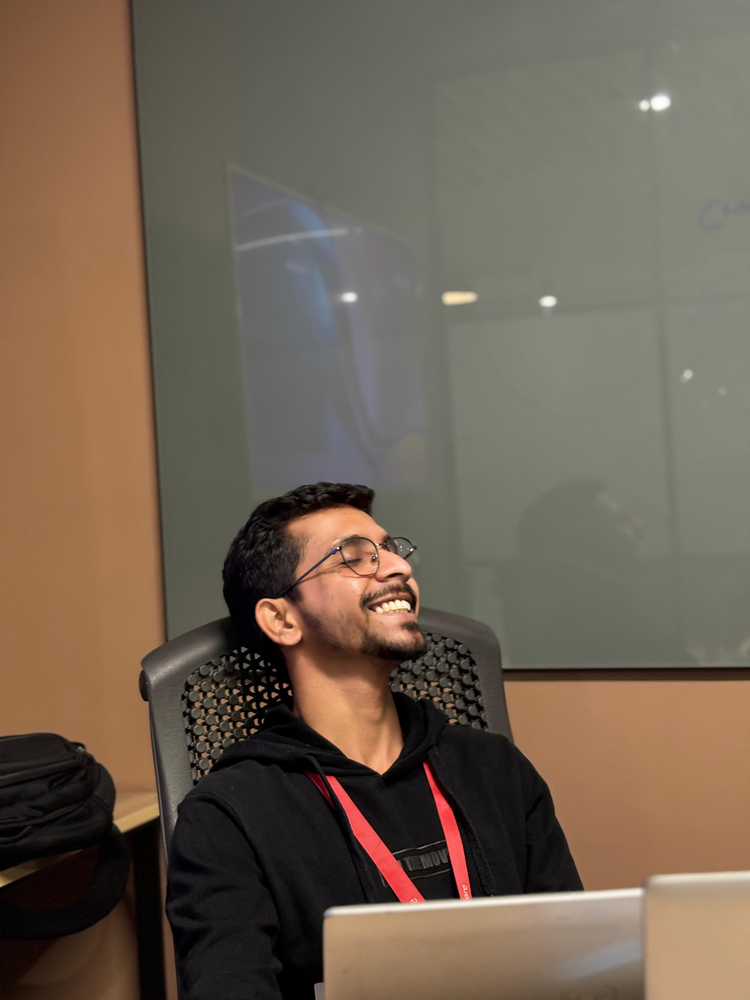

  
    
  <h1>Chinmay Dhok</h1>
   
  <h3>Senior Information Security Analyst & Cloud Architect</h3>
  
<i>Bridging the gap between high-velocity engineering and rigorous enterprise compliance.</i>

   
  
  

    
    
    
    
  

 

  
  
  
  
  

 

---

## 📥 Access My Resumes & Documents

> 💡 **Recruiters & Hiring Managers:** I maintain multiple versions of my resume to best suit different ATS constraints and stylistic preferences. You can download all PDFs directly from my **[Resume Repository](https://github.com/chinmay-dhok/resume)**.

| Document Type | Description | Link |
|:---|:---|:---|
| 📄 **Modern Resume (2026)** | ATS-optimized, punchy bullet points with high visual impact. | [View Repository](https://github.com/chinmay-dhok/resume) |
| 📄 **Classic Resume** | Traditional styling with cleanly summarized paragraph experiences. | [View Repository](https://github.com/chinmay-dhok/resume) |
| 📝 **Cover Letter** | A structured overview highlighting my Zero-Trust \& DevSecOps achievements. | [View Repository](https://github.com/chinmay-dhok/resume) |

---

## 🛡️ Who I Am

I am a security-focused engineering leader with **6+ years of progressive experience** scaling enterprise cloud environments. My career is defined by a successful evolution from deep systems engineering (architecting networks for 1500+ users across Azure/AWS) to my current focus: **Enterprise Information Security, Governance, and Zero-Trust Architecture**.

> **My Core Value Proposition:** I possess the operational depth to build and migrate massive cloud infrastructures, combined with the strategic oversight required to secure them against modern threats and stringent compliance frameworks (SOC 2, GDPR, CCPA).

---

## 🚀 Key Achievements & Capabilities

### 🔐 Zero-Trust Cloud Architecture
* **GCP PAM & Tailscale**: Engineered Privileged Access Management entitlements as Infrastructure-as-Code (Terraform), transitioning legacy VPN perimeters to encrypted, identity-aware Zero-Trust networks.
* **Infrastructure Hardening**: Migrated 200+ workloads to Azure DevOps, configured secure hybrid networking, and provisioned production-grade GCS buckets with UBLA/PAP.

### 📋 Enterprise Compliance & Governance
* **ISO 27001 & SOC 2 Type II**: Led Stage-2 Surveillance Audits achieving re-certification with zero major non-conformities, and managed full SOC 2 lifecycles yielding clean, unqualified reports.
* **Automated TPRM**: Engineered LLM-powered knowledge bases to auto-answer vendor security questionnaires and DPIA/PIA documents, cutting response times from days to hours.

### ⚙️ DevSecOps & Supply Chain Security
* **Org-Wide Vulnerability Management**: Executed automated audits across **524+ code repositories**, remediating critical CVEs and enforcing strict semantic version pinning.
* **CI/CD Security Pipelines**: Integrated automated code review and security scanning gates into GitHub Actions, blocking non-compliant Pull Requests before they merge.

---

## 📂 Featured Architecture & Security Projects

| Project | Description | Stack |
|---------|-------------|-------|
| 🛡️ [**GCP Zero-Trust Architecture**](https://github.com/chinmay-dhok/GCP-Zero-Trust-Architecture) | Production-grade PAM framework and VPN-to-Tailscale migration defined as IaC. | `Terraform` `GCP` `Tailscale` |
| 🔍 [**Automated Compliance Auditor**](https://github.com/chinmay-dhok/Automated-Compliance-Auditor) | LLM-powered platform to monitor ISO 27001/SOC 2 and auto-answer vendor questionnaires. | `Python` `Gemini` `Scrut` |
| 🔗 [**Supply Chain Security Hardening**](https://github.com/chinmay-dhok/Supply-Chain-Security-Hardening) | Org-wide dependency auditing, CVE remediation, and CI/CD security pipelines. | `GitHub Actions` `Python` |
| 🤖 [**DevFlowBot (AI PR Agent)**](https://github.com/chinmay-dhok/DevFlowBot-Gemini-3-Pro-GitHubPR) | Autonomous agent for automating frontend workflows with human-in-the-loop QA gates. | `Gemini API` `GitHub` |

---

## 🏅 Certifications

<b>View Microsoft Certifications</b>

 
  
- [**Microsoft Certified: Information Security Administrator Associate** (SC-401)](https://learn.microsoft.com/en-us/users/chinmaydhokmaqsoftware-5822/credentials/a1cf65d95f479d50)
- [**Microsoft Certified: Identity and Access Administrator** (SC-300)](https://learn.microsoft.com/en-us/users/chinmaydhokmaqsoftware-5822/credentials/59a68cc7be408e04)
- [**Microsoft Certified: Azure Network Engineer Associate** (AZ-700)](https://learn.microsoft.com/en-us/users/chinmaydhokmaqsoftware-5822/credentials/9329188e7a858597)
- [**Microsoft Certified: Azure Virtual Desktop Specialty** (AZ-140)](https://learn.microsoft.com/en-us/users/chinmaydhokmaqsoftware-5822/credentials/d117ef366173ddc6)
- [**Microsoft Certified: Azure Security Engineer Associate** (AZ-500)](https://learn.microsoft.com/en-us/users/chinmaydhokmaqsoftware-5822/credentials/13c8e434db03407e)
- [**Microsoft 365 Certified: Security Administrator Associate** (MS-500)](https://learn.microsoft.com/en-us/users/chinmaydhokmaqsoftware-5822/credentials/c0ae1a2902b51750)
- [**Microsoft Certified: Security Operations Analyst Associate** (SC-200)](https://learn.microsoft.com/en-us/users/ChinmayDhokMAQSoftware-5822/credentials/E22E4108C28D9FF2)
- [**Microsoft Certified: Azure Administrator Associate** (AZ-104)](https://learn.microsoft.com/en-us/users/chinmaydhokmaqsoftware-5822/credentials/ccf1857230b93a53)

 

  
  

